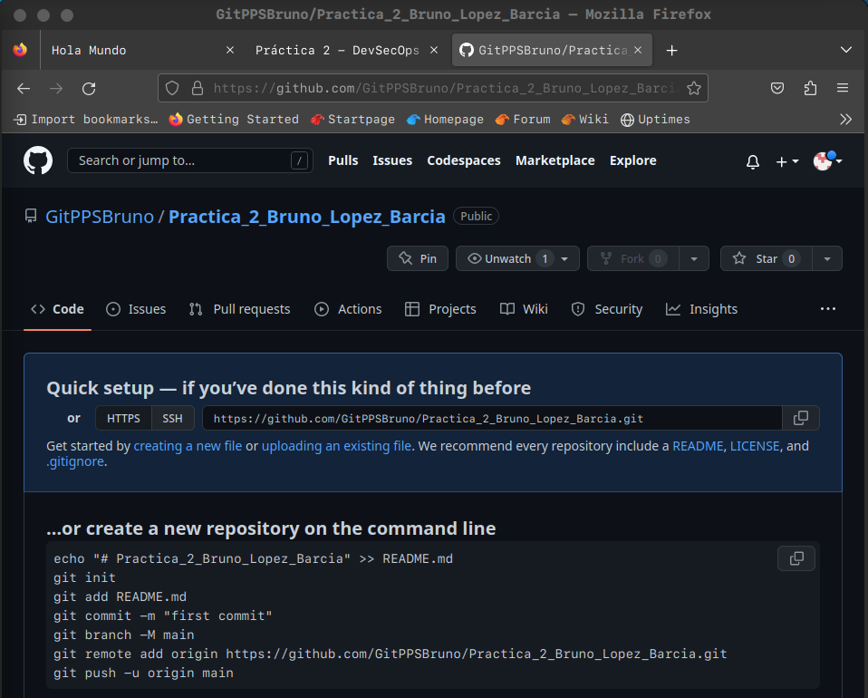
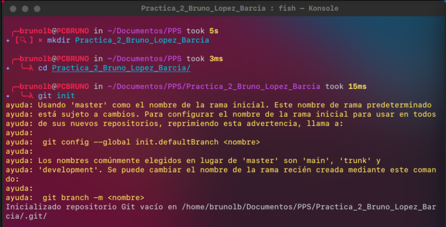
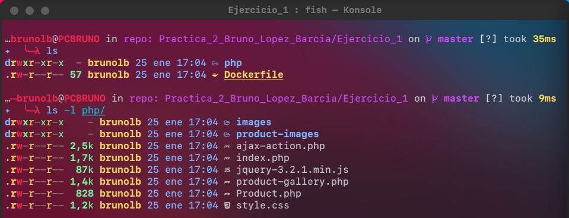
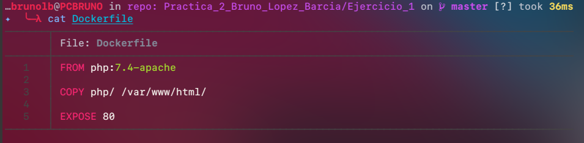
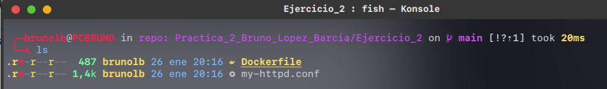
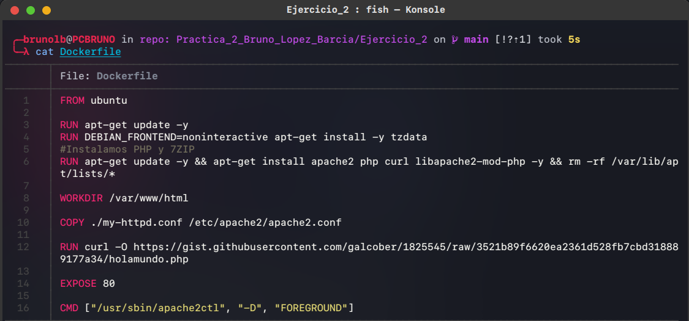

# Memoria Practica 2 Bruno Lopez Barcia 

----

## PreRequisitos

Lo primero que debemos de hacer es crear es el repositorio de git e inicializar el repositorio en local.

Para crear un nuevo repositorio en GitHub debemos de ir a nuestro perfil de GitHub y darle a __Añadir un nuevo repositorio__. Una vez creada nos aparecera esta pantalla:



Una vez nos salga eso debemos de ir a la carpeta donde queremos inicializar nuestro repositorio en local y ejecutar los siguiente:



---
## Ejercicio 1

1. Crea un Dockerfile que partiendo de una imagen PHP genera una imagen que:
	1. Copia una aplicacion en PHP a un directorio del contenedor. Esta aplicacion se debe copiar directamente desde un directorio del anfitrión. Para facilitar las cosas, debe de ser una aplicacion sencilla que no emplee bases de datos (ya que sino tambien habría que instalar un Mysql)
---
Una vez que tenemos los prerequisitos hechos debemos de crear la carpeta del Ejercicio 1. En esta carpeta añadiremos el Dockerfile del ejercicio1, del que luego generaremos la imagen. 

Contenido carpeta Ejercicio1:


El contenido del Dockerfile es el siguiente:



En la linea uno lo que hacemos en usar una imagen de PHP en su version 7.4 con apache. En la linea 2 copiamos la carpeta PHP de nuestra maquina y por ultimo debemos de exponer el puerto 80.

Una vez que tenemos configurado el _Dockerfile_ y las carpetas configuradas lo que tenemos que hacer es subir ambas carpetas al repositorio de Github. Debemos de ejecutar los siguientes comandos

````bash
git add Ejercicio1/ images/ Memoria.md

git commit -m "Añaido ejercicio 1 y la parte correspondiente de la memoria"

git push -u origin main
````


----
2.  Crea un DockerFile que partiendo de una imagen Ubuntu genera una imagen que:
	1. Instala Apache, de forma que se exponga el puerto 80
	2. Instala PHP
	3. Copia una aplicación web de PHP al directorio de Apache que expone las paginas web. Esta aplicacion se debe descargar automáticamente mediante algún comando como _git clone_ o _curl_. Para facilitar las cosas, debe de ser una aplicación sencilla que no emplee bases de datos(ya que si no también habría que instalar un MySQL).

---

Una vez que tenemos los prerequisitos hechos debemos de crear la carpeta del Ejercicio 2. En esta carpeta añadiremos el Dockerfile del Ejercicio2, del que luego generaremos la imagen. 

Contenido carpeta Ejercicio2:



El contenido del Dockerfile es el siguiente:



En la linea uno lo que hacemos es usar una imagen de Ubuntu en su ultima versión. En la linea 3 ejecutamos ```apt-get update -y``` que sirve para actualizar los repositorio de la maquina, para posteriormente instalar aplicaciones.

En la linea 4 y 5 instalamos los paquetes _tzdata apache2 curl y libapache2-mod-php_, que son los paquetes necesarios para que funcionen los proximos pasos. Al final para que la imagen tenga un peso menor, ejecutare el comando ```rm -rf /var/lib/apt/lists/*```. 

En la linea 8 debemos de movernos a la carpeta _/var/www/html_ para luego posteriormente en las linea 12, realizar acciones que se realizan en esa carpeta.

En la linea 10 lo que hacemos es copiar el my-httpd.conf personalizado que tenemos en la carpeta local a la carpeta de _/etc/apache/apache2.conf_.

En la linea 12 lo que hacemos es descargar la aplicacion PHP desde github con el comando _curl_. 

Por ultimo debemos de exponer el puerto __80__ del contenedor y ejecutar en modo demonio el servicio de apache con el comando ```CMD ["/usr/sbin/apache2ctl", "-D", "FOREGROUND"]```

Una vez que tenemos configurado el _Dockerfile_ y las carpetas configuradas lo que tenemos que hacer es subir ambas carpetas al repositorio de Github. Debemos de ejecutar los siguientes comandos

````bash
git add Ejercicio2/ images/ Memoria.md

git commit -m "Añaido ejercicio 2 y la parte correspondiente de la memoria"

git push -u origin main
````


